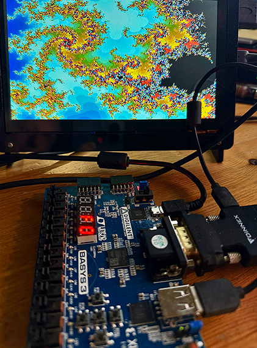
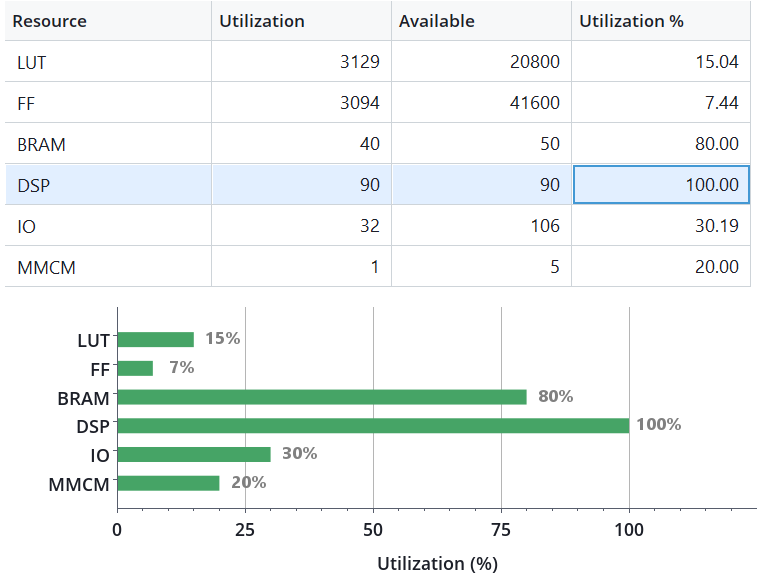

# mandel_basys3
## A fast (1.5 GigaIters/s) interactive Mandelbrot generator for the Digilent Basys3 FPGA trainer board.

# REQUIREMENTS

- Digilent Basys3 FPGA trainer board.
- VGA display (or HDMI via a cheap VGA to HDMI converter).

# CONTROLS

Use the "cross" buttons (U,D,L,R,C) on the Basys3 board.
- Up, Down, Left, Right: Move around in complex plane.

Keep the C (Center) button pressed for these actions:
- Center + Up: Zoom in 2x.
- Center + Down: Zoom out 2x.
- Center + Left: Increase iterations.
- Center + Right: Decrese iterations.

4-Digit LED display:
- If Center button is NOT pressed: Display current calculation line in hex [0x00..0xF0].
- If Center button is pressed: Display current max_iters per pixel in hex [0x010..0xFFF].

# SUPPORTED RESOLUTIONS
- 320x240, RGB 4:4:4.

The default number of max iterations is 128, but the user can interactively change them in the range [16..4095].  

NOTE: The limited amount of BRAM in the Basys3 (XC7A35T) only allows for a 320x240 (QVGA) framebuffer. We upscale it to output 640x480 VGA @ 60 Hz.  
NOTE: The simple coloring algorithm maps iterations using a palette of 256 colors. However, the framebuffer is RGB 4:4:4, so an enhanced version with a custom coloring algorithm can be implemented with up to 4096 simultanous colors on screen.

# ALGORITHM

### Mandelbrot calculation

This is a brute force algorithm using Q3.22 fixed-point precision.  
We don't need heuristic optimizations, as we can reach interactive rates also at the maximum 4095 iters/pixel.  
The dirty work is done by the **15 Mandelbrot calculation cores** working in parallel at 100 MHz.  
Each core uses 6 DSP48E1 resources on the FPGA to calculate 1 Mandelbrot iteration per clock cycle. Aggregate computational power of all 15 cores (90 DSP) is 1.5 GigaIters/sec.  
Each cycle, if a core has completed calculation, we write one pixel to the dual-ported BRAM framebuffer. We also schedule calculation of new pixels to free cores.

### Note about fixed-point precision

There are two different fixed-point notations using "Q" numbers. TI and ARM. I am using ARM notation. More info here:  
https://en.wikipedia.org/wiki/Q_(number_format)  

The current implementation uses Q3.22 (25 bits total).  
The Mandelbrot set is contained in a circle with radius 2. However, during calculation, numbers greater than 2 are encountered, depending on the point being calculated.  
Here is the maximum magnitude reached for each point during the calculation:  

Q3.22 (25 bits) is the best compromise between max-zoom and speed for the Artix7 FPGA.  
We use 25-bit numbers to maximize usage of DSP48E1 resources in the Artix7.  
Even if we use 25-bits number, we can perform the Mandel escape test on mult partials using more bits. This is unlikely many CPU mult implementations, and allows using only 3 bits (Q3) for the integral part of the calculation registers, and allocate more bits (22) to the fractional part for a deeper zoom.

### FPGA Utilization

This is on a Xilinx XC7A35T. Notice how we use all 90 (100%) DSP48E1 blocks and 80% BRAM, while other FPGA resources are mostly free. 

# LICENSE

Creative Commons, CC BY

https://creativecommons.org/licenses/by/4.0/deed.en

Please add a link to this github project.
